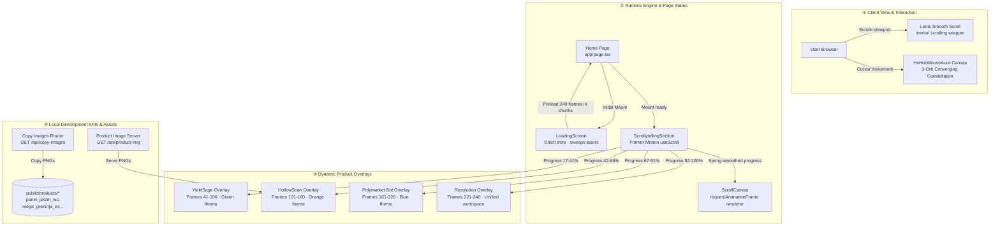

# HS Hub — Product Unified Space

<p align="center">
  <strong>A cinematic scrollytelling workspace portal unifying DeFi yield intelligence, retail deal-scanning, and a prediction market trading bot.</strong>
</p>

<p align="center">
  &nbsp;
  &nbsp;
  &nbsp;
  &nbsp;
  &nbsp;
  
</p>

---

> **HS Hub** is an industrial-grade, single-page cinematic scrollytelling web application designed to act as a unified dashboard and portal for three primary products: **YieldSage** (DeFi yield intelligence on Mantle Network), **HollowScan** (retail arbitrage deal-scanning application), and **Polymarket Trading Bot** (autonomous prediction market analytics and execution bot). Replicating and extending the high-performance HTML5 canvas scroll-scrub sequence, spring-smoothed overlay transitions, and premium fintech aesthetic from the YieldSage frontend, the workspace binds all three assets together under a single cohesive, high-performance web experience.

---

## 📖 Table of Contents

- [🏛️ Workspace System Architecture](#-workspace-system-architecture)
- [✨ Core Feature Highlights](#-core-feature-highlights)
- [🎬 Cinematic UI/UX Engine](#-cinematic-uiux-engine)
  - [1. Canvas Scroll-Scrubbing & Spring Physics](#1-canvas-scroll-scrubbing--spring-physics)
  - [2. Progressive Frame Loading & Batch Buffer](#2-progressive-frame-loading--batch-buffer)
  - [3. High-Fidelity Glitch Intro & Loading Screen](#3-high-fidelity-glitch-intro--loading-screen)
  - [4. Three-Orb Mouse Aura Constellation Follower](#4-three-orb-mouse-aura-constellation-follower)
  - [5. Smooth Scrolling & Keyframe Animations](#5-smooth-scrolling--keyframe-animations)
- [📂 Project Structure & Module Mapping](#-project-structure--module-mapping)
- [🔌 Local Development Helper APIs](#-local-development-helper-apis)
  - [1. Image Synchronization Endpoint](#1-image-synchronization-endpoint)
  - [2. Image Server Endpoint](#2-image-server-endpoint)
- [🔧 Complete Tech Stack](#-complete-tech-stack)
- [🚀 Setup & Running Locally](#-setup--running-locally)

---

## 🏛️ Workspace System Architecture

HS Hub runs as a fully client-rendered interactive portal utilizing Next.js 16, React 19, and Framer Motion 12. The data, rendering, and interaction pipeline flow as follows:



---

## ✨ Core Feature Highlights

| Feature Area | Technical Description | Implemented In |
|---|---|---|
| 🔄 **Canvas Scroll Scrub** | High-performance frame-by-frame JPEG rendering tied to viewport scroll progress using `requestAnimationFrame` and device pixel ratio calculations. | [scroll-canvas.tsx](file:///c:/Users/Jo$h/Desktop/Visual%20Studio%20Code/HS%20Hub/components/scroll-canvas.tsx) |
| 🛡️ **Flicker-Free Fallback** | Backward scanning loop that instantly grabs the nearest fully cached frame if a target image is not loaded yet, preventing blank black flashes during fast scrubs. | [scroll-canvas.tsx](file:///c:/Users/Jo$h/Desktop/Visual%20Studio%20Code/HS%20Hub/components/scroll-canvas.tsx) |
| 🌀 **Spring Physics Scroll** | Smooths raw scroll updates through organic spring physics (`stiffness: 50`, `damping: 20`) via Framer Motion's `useSpring`. | [scrollytelling-section.tsx](file:///c:/Users/Jo$h/Desktop/Visual%20Studio%20Code/HS%20Hub/components/scrollytelling-section.tsx) |
| 💫 **3-Orb Mouse Constellation** | Renders 3 separate colored orbs (Green, Orange, Blue) drifting towards the cursor with independent lag weights (`0.035`, `0.022`, `0.014` lerp weights) for deep parallax. | [hs-hub-mouse-aura.tsx](file:///c:/Users/Jo$h/Desktop/Visual%20Studio%20Code/HS%20Hub/components/hs-hub-mouse-aura.tsx) |
| 🔌 **Local Image Sync APIs** | Automated endpoints to copy and serve Pokémon and retail product assets directly from IDE storage into the workspace public folder. | [route.ts](file:///c:/Users/Jo$h/Desktop/Visual%20Studio%20Code/HS%20Hub/app/api/copy-images/route.ts) |
| ⚙️ **Glitch Character Scramble** | Preloading interface running a character-by-character probability scramble that resolves frame-by-frame into the brand name text. | [loading-screen.tsx](file:///c:/Users/Jo$h/Desktop/Visual%20Studio%20Code/HS%20Hub/components/loading-screen.tsx) |
| 📈 **Animated Telemetry Chart** | Renders a custom SVG path representing real-time Polymarket trade telemetry with dashed dash-offset line drawings and flashing node markers. | [page.tsx](file:///c:/Users/Jo$h/Desktop/Visual%20Studio%20Code/HS%20Hub/app/page.tsx) |
| 📱 **Phone UI Loop-Scroll** | Highly detailed, interactive Apple iOS mockup enclosing a loop-scrolling deal feed displaying real-time Pokémon card arbitrage price cards. | [page.tsx](file:///c:/Users/Jo$h/Desktop/Visual%20Studio%20Code/HS%20Hub/app/page.tsx) |

---

## 🎬 Cinematic UI/UX Engine

### 1. Canvas Scroll-Scrubbing & Spring Physics
The core of the scrollytelling page is the canvas scroll scrubbing engine. Instead of standard page layouts, scrolling the mouse wheel scrolls the viewport through a **650vh** scroll volume container ([scrollytelling-section.tsx](file:///c:/Users/Jo$h/Desktop/Visual%20Studio%20Code/HS%20Hub/components/scrollytelling-section.tsx)).

- **Framer Motion Intercept**: The component uses `useScroll` to determine the raw percentage (0.0 to 1.0) of scroll progress.
- **Spring Smoothing**: Raw progress passes into a Framer Motion `useSpring` hook with configured parameters (`stiffness: 50, damping: 20, restDelta: 0.0005`). This gives the scrolling an organic momentum, catching up smoothly to user motion rather than jumping instantly.
- **requestAnimationFrame Draw Tick**: The `ScrollCanvas` component ([scroll-canvas.tsx](file:///c:/Users/Jo$h/Desktop/Visual%20Studio%20Code/HS%20Hub/components/scroll-canvas.tsx)) listens to the spring-smoothed scroll progress change. Upon receiving an update, it cancels any scheduled frame updates and runs `requestAnimationFrame` to draw the target image index onto an HTML5 `<canvas>`.
- **DPR & Scale Adjustment**: The canvas tracks device pixel ratios (`window.devicePixelRatio`) and scales the viewport draw context dynamically to prevent blurriness on 4K, retina, or high-density monitors.

```
[User Scroll Action] ──> [useScroll Progress (0 -> 1)] ──> [useSpring Physics Smoothing]
                                                                        │
[Canvas Repaint & Aspect Fill] <── [requestAnimationFrame Draw] <───────┘
```

### 2. Progressive Frame Loading & Batch Buffer
To keep the initial page load speed fast while managing 240 high-resolution desktop frames, HS Hub utilizes a custom preloader system ([loading-screen.tsx](file:///c:/Users/Jo$h/Desktop/Visual%20Studio%20Code/HS%20Hub/components/loading-screen.tsx)):

- **Image Preloader Buffer**: Frames are downloaded in parallel batches of 20. The loader records all successfully loaded images inside an array memory slot.
- **Robust Failure Protection**: If any frame fails to download, the preloader registers the event, records the index, and proceeds so the user interface never hangs on network interruptions.
- **Canvas Backwards Scan Loop**: During fast scrolls, if the target image index is not fully cached in memory, the canvas rendering loop scans backwards through the array to locate the nearest previously loaded frame. This completely eliminates blank flashes and guarantees a stable display stream.

### 3. High-Fidelity Glitch Intro & Loading Screen
The initialize loader is designed to make a luxury brand statement rather than show a simple spinner.

- **Glitch Character Scramble**: The brand text "HS HUB" begins as a randomized set of symbols (`@#$%&*`). Over the course of 20 ticks, the probability of drawing the correct characters scales up linearly, resolving one character at a time.
- **Laser Scan Line**: A glowing green gradient bar sweeps vertically down the viewport, tracking the exact image buffer percentage loaded.
- **Double Orbiting Status Dots**: Two neon green status indicators revolve around a central glassmorphic box on inverse rotation paths.
- **Console status readings**: The UI displays status lines checking when each sequence (YieldSage, HollowScan, Polymarket Bot) is synced and ready.

### 4. Three-Orb Mouse Aura Constellation Follower
Beneath the HTML5 canvas and text overlays, the workspace renders a custom mouse follower canvas ([hs-hub-mouse-aura.tsx](file:///c:/Users/Jo$h/Desktop/Visual%20Studio%20Code/HS%20Hub/components/hs-hub-mouse-aura.tsx)) creating natural visual depth:

- **Orb Constellation**: Instead of a single cursor follower, three independent radial gradients are rendered:
  - **YieldSage Green Orb**: Fast follower (`lerp 0.035`), representing DeFi growth.
  - **HollowScan Orange Orb**: Moderate follower (`lerp 0.022`), representing retail deal matching.
  - **Polymarket Blue Orb**: Slow follower (`lerp 0.014`), representing prediction market trades.
- **Autonomously Floating Parallax**: Each orb incorporates desynchronized sine and cosine drifts, making them float, expand, and compress in a breathing motion even when the cursor is static.
- **Floating Telemetry Readouts**: Monospace labels drift on rotated paths across the screen, displaying mock tech telemetry like:
  - `YIELDSAGE::MANTLE_NET_SYNC: OK`
  - `HOLLOWSCAN::BARCODE_DB: LIVE`
  - `POLYMARKET_STREAM: connected`
- **Cinema-Grade SVG Noise**: Overlayed on top of the gradient canvas is a high-resolution SVG fractal noise filter to create a luxury grain feel.

### 5. Smooth Scrolling & Keyframe Animations
- **Lenis Smooth Scroll**: Wrapped in a React context provider ([lenis-provider.tsx](file:///c:/Users/Jo$h/Desktop/Visual%20Studio%20Code/HS%20Hub/components/lenis-provider.tsx)) using `lenis/react`. Set to a lerp rate of `0.1` and a duration of `1.5s` to smooth trackpad and mouse-wheel inertia.
- **Announcement Ticker**: Runs an infinite CSS translate-X keyframe animation (`ticker-scroll`) to loop announcements seamlessly.
- **TCG Deal Feed Scroll**: Runs a vertical scroll translation (`feed-scroll`) inside the iPhone mock screen, moving product items upward and wrapping them seamlessly.
- **Polymarket Bot Telemetry Line**: Animates path dash arrays (`draw-chart`) to draw a confidence line graph repeatedly.

---

## 📂 Project Structure & Module Mapping

```text
HS-Hub/
│
├── app/                                 # Next.js App Router Page Configs
│   ├── api/                             # Local development helper API endpoints
│   │   ├── copy-images/
│   │   │   └── route.ts                 # GET /api/copy-images - syncs local artifact assets
│   │   └── product-img/
│   │       └── route.ts                 # GET /api/product-img - serves active product images
│   │
│   ├── privacy/
│   │   └── page.tsx                     # Redirect page routing to /privacy-policy
│   │
│   ├── privacy-policy/
│   │   └── page.tsx                     # Privacy Policy: detailed 7-section scroll-spy layout
│   │
│   ├── globals.css                      # Tailwind v4 imports, brand OKLCH colors, keyframe animations
│   ├── icon.tsx                         # Next.js dynamic metadata app icon SVG compiler
│   ├── layout.tsx                       # Root layout: Inter/Cormorant fonts, Metadata, LenisProvider
│   └── page.tsx                         # Main Page: navigation, YieldSage demo, phone mockup, Polymarket chart
│
├── components/                          # Core UI components
│   ├── hs-hub-mouse-aura.tsx            # Multi-brand canvas mouse aura & telemetry labels
│   ├── lenis-provider.tsx               # Lenis smooth-scroll provider config
│   ├── loading-screen.tsx               # Glitch intro screen & frame preloading batcher
│   ├── scroll-canvas.tsx                # HTML5 canvas requestAnimationFrame sequence drawer
│   └── scrollytelling-section.tsx       # 650vh scroll area, Framer Motion spring physics, overlays
│
├── public/                              # Static Assets
│   ├── frames/                          # Pre-rendered 3D animation canvas frame JPEGs (ezgif-frame-001.jpg)
│   ├── products/                        # Pokémon/TCG arbitrage product images
│   ├── videos/                          # YieldSage walkthrough mp4 video demo
│   └── logo.png                         # HS Hub logo
│
├── copy_products.ps1                    # Utility PowerShell script to copy local IDE assets
├── next.config.mjs                      # Next.js config parameters
├── postcss.config.mjs                   # PostCSS Tailwind CSS v4 processor setup
├── tsconfig.json                        # Strict TypeScript compilation configs
└── package.json                         # Node dependency definitions and run scripts
```

---

## 🔌 Local Development Helper APIs

To make workspace asset setup simple, HS Hub includes two local API helper routers. They map files between the IDE sandbox artifacts directory and the next.js server public space.

### 1. Image Synchronization Endpoint
- **Path**: [`/api/copy-images`](file:///c:/Users/Jo$h/Desktop/Visual%20Studio%20Code/HS%20Hub/app/api/copy-images/route.ts)
- **Method**: `GET`
- **Behavior**: Scans the user home directory folder for the latest downloaded IDE product assets:
  - `panini_prizm_wc_1783754804652.png` -> copies to `public/products/panini_prizm_wc.png`
  - `mega_greninja_ex_1783754812628.png` -> copies to `public/products/mega_greninja_ex.png`
  - `perfect_order_box_1783754824354.png` -> copies to `public/products/perfect_order_box.png`
  - `trainers_toolkit_1783754833334.png` -> copies to `public/products/trainers_toolkit.png`
- **Response Schema**:
  ```json
  {
    "success": true,
    "message": "Successfully copied images to public/products/ folder.",
    "files": ["panini_prizm_wc.png", "mega_greninja_ex.png", "perfect_order_box.png", "trainers_toolkit.png"]
  }
  ```

### 2. Image Server Endpoint
- **Path**: [`/api/product-img`](file:///c:/Users/Jo$h/Desktop/Visual%20Studio%20Code/HS%20Hub/app/api/product-img/route.ts)
- **Method**: `GET`
- **Parameters**: `?name=panini_prizm_wc | mega_greninja_ex | perfect_order_box | trainers_toolkit`
- **Behavior**: Reads the corresponding file directly from the local workspace artifact cache directory and returns a raw image binary. It includes cache control headers for performance.
- **Headers**:
  - `Content-Type`: `image/png`
  - `Cache-Control`: `public, max-age=31536000, immutable`

---

## 🔧 Complete Tech Stack

- **Core Application Framework**: Next.js 16.0.10 (App Router topology)
- **UI Engine**: React 19.2.0 & React DOM 19.2.0
- **Styling**: Tailwind CSS v4.1.9 with `@tailwindcss/postcss` and PostCSS 8.5
- **Animations & Physics**: Framer Motion 12.34.3
- **Smooth Scroll Inertia**: Lenis 1.1.20 with `lenis/react`
- **Icons**: Lucide React 0.454.0
- **Base Components**: Radix UI Primitives (Slot, Separator, Dialog, Dropdown Menu)
- **Language**: TypeScript 5 with strict compiler type mappings

---

## 🚀 Setup & Running Locally

### 1. Prerequisite Installations
Ensure you have **Node.js** (v18.0 or newer) installed.

### 2. Project Installation
Open a terminal in the root directory ([HS Hub Workspace](file:///c:/Users/Jo$h/Desktop/Visual%20Studio%20Code/HS%20Hub)) and execute:
```bash
npm install
```

### 3. Run in Development Mode
Launch the local developer Turbopack development instance:
```bash
npm run dev
```
Open [http://localhost:3000](http://localhost:3000) in your browser.

### 4. Create a Production Bundle
Build and compile the workspace into static optimized output:
```bash
npm run build
```
Start the compiled production server:
```bash
npm run start
```
